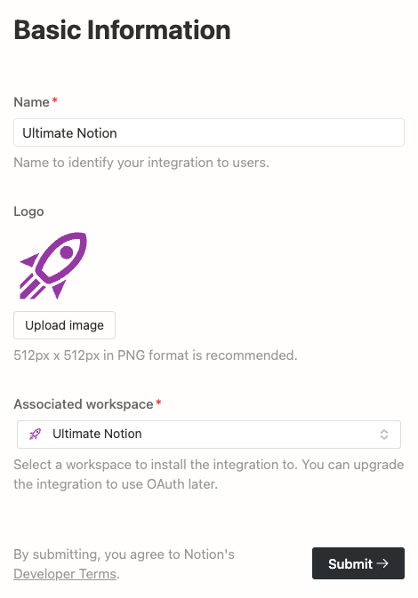

# Getting Started

Before we get started a few words about Notion and its basic concepts are appropriate. In Notion everything is either
a *page* or a *block*. Typical blocks are headings, text, bulleted list, tables, quotes and so on.

An important and special block is the *database*, which may be  within a page, i.e. *inline*,
or at the same hierarchy level as a *page*. A *database* has a *schema*, that specifies various structured *properties*
of the individual pages contained in that database. Only pages contained in a database have properties. Regardless of
the properties, each page has *attributes* such as a title, cover, icon, or whether it is archived or not.

A page, e.g. with title "child-page", can be contained in another page, e.g. with title "parent-page". This leads to a
hierarchy that is typically used for structuring content. We say that "parent-page" is the *parent* of "child-page" and
"child-page" is one of the *children* of "parent-page".
This concept is important as access permissions for integrations are inherited from parent pages. Permissions can
be only granted to pages, not to complete workspaces encompassing all pages.

## Installation

To install Ultimate Notion simple run:
```commandline
pip install ultimate-notion
```
Ultimate Notion needs at least Pyton 3.10. Depending on your system, you might need to use [pyenv], [conda], etc. to
install a more uptodate version.

## Creating an integration

Now open the web interface of [Notion], select a workspace, click <kbd>Settings & members</kbd>, click <kbd>Connections</kbd>
and choose <kbd>Develop or manage integrations</kbd>. This should take you to the [My integrations] site. Now select
<kbd>+ Create new integration</kbd>, provide a name, a logo and select the Notion workspace the integration should be
associated to. After that click the <kbd>Submit</kbd> button.

{: style="height:600px; display:block; margin-left:auto; margin-right:auto;"}

This brings you to the Secrets-site where you need to copy and save the *Internal Integration Token*, which always starts
with `secret_`. This token will be used by Ultimate Notion for authentication.


## Granting access to a page for an integration

Open Notion, i.e. the web interface or your Notion app. Make sure the integration you created shows up under
<kbd>Settings & members</kbd> » <kbd>Connections</kbd>. Now select any page you want to access via Ultimate Notion and
select the <kbd>···</kbd> on the upper right. In the drop-down menu, scroll down, select <kbd>+ Add connections</kbd>,
search and select your created integration. A pop-up that you need to confirm will inform you that your integration
will have access to the selected page as well as all its children.

{: style="width:400px; display:block; margin-left:auto; margin-right:auto;"}


## Access the page with Python

To try out if your integration works, just copy&paste the following code into your favorite editor. Replace the content
of `TOKEN` with the Internal Integration Token you saved and the content of `PAGE_TITLE` with the title of the page, you granted
access for your integration.


``` py
--8<-- "../../examples/getting_started.py"
```


[My integrations]: https://www.notion.so/my-integrations
