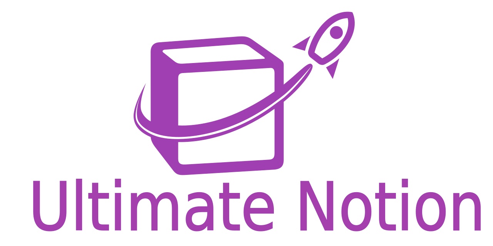

# ​

{: style="height:200px; display:block; margin-left:auto; margin-right:auto;"}

 

Ultimate Notion is the ultimate Python library for [Notion]! It allows you to access and modify your Notion databases and
pages in the most convenient and pythonic way.

**This is a pre-alpha version! Don't use it!**

## Features

#### Databases
  - [x] searching & retrieving databases by name or id
  - [x] creating new databases and deleting them
  - [ ] modifying properties of contained pages
  - [ ] archiving and creating new pages using the schema of the database
  - [ ] having an easy-to-use sorted & filtered, *view* on the database, e.g. in [Jupyter Lab]
  - [ ] update the attributes or schema of a database
#### Pages
  - [ ] searching & retrieving pages by name and id
  - [ ] modifying the attributes of pages, i.e. title, icon, etc.
  - [ ] modifying the blocks, e.g. headlines, bulleted lists, etc. of pages
  - [ ] viewing the content of pages in different formats, e.g. [Markdown]
#### Users
  - [x] list all users and self identify
  - [x] retrieve a user and its properties
#### Comments
  - [ ] creating a comment
  - [ ] retrieving a comment

## License

Ultimate Notion is distributed under the terms of the [MIT] license.

## Navigation

Documentation for specific `MAJOR.MINOR` versions can be chosen by using the dropdown on the top of every page.
The `dev` version reflects changes that have not yet been released. Shortcuts can be used for navigation, i.e.
<kbd>,</kbd>/<kbd>p</kbd> and <kbd>.</kbd>/<kbd>n</kbd> for previous and next page, respectively, as well as
<kbd>/</kbd>/<kbd>s</kbd> for searching.
