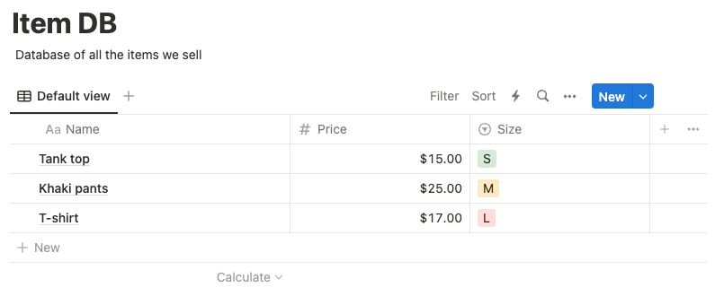
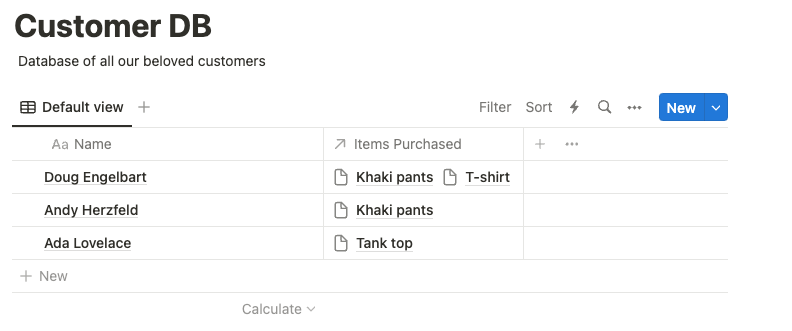

# Data models & schemas

We gonna create two simple databases with a relation quite similar as described
in the [Notion docs]. We gonna have a database for customers and one for items,
which customers can purchase.

Let's first initialize a Notion session with

```python
import ultimate_notion as uno

notion = uno.Session.get_or_create()
```

## Working with database schemas

We start by defining the schema for our items in a really pythonic way.
The schema should have three columns, the title column `Name` for the name of an item, e.g. "Jeans",
a size column `Size` and of course a `Price` column numbers in Dollars. The size of of piece of
clothing can be chosen from the options `S`, `M` and `L`. We can directly translate this schema into
Python code:

```python
class Size(uno.OptionNS):
    """Namespace for the select options of our various sizes"""
    S = uno.Option(name='S', color='green')
    M = uno.Option(name='M', color='yellow')
    L = uno.Option(name='L', color='red')


class Item(uno.PageSchema, db_title='Item DB'):
    """Database of all the items we sell"""
    name = uno.Column('Name', uno.ColType.Title())
    size = uno.Column('Size', uno.ColType.Select(Size))
    price = uno.Column('Price', uno.ColType.Number(uno.NumberFormat.DOLLAR))
```

Since a database needs to be a block wighin a page, we assume there is a page called
`Tests`, which is connected with this integration. We retrieve the object of
this page and create the database with the page as parent page.

```python
root_page = notion.search_page('Tests', exact=True).item()
item_db = notion.create_db(parent=root_page, schema=Item)
```

Now we create a database for our customers and define a one-way relation to the items:

```python
class Customer(uno.PageSchema, db_title='Customer DB'):
    """Database of all our beloved customers"""
    name = uno.Column('Name', uno.ColType.Title())
    purchases = uno.Column('Items Purchased', uno.ColType.Relation(Item))

customer_db = notion.create_db(parent=root_page, schema=Customer)
```

Now that we have created those two databases, we can start filling them with a few items
either using the [create_page] method of the database object:

```python
t_shirt = item_db.create_page(name='T-shirt', size=Size.L, price=17)
khaki_pants = item_db.create_page(name='Khaki pants', size=Size.M, price=25)
tank_top = item_db.create_page(name='Tank top', size=Size.S, price=15)
```

or we can also directly use the [create] method of the schema if the schema is already bound
to a database:

```python
lovelace = Customer.create(name='Ada Lovelace', purchases=[tank_top])
hertzfeld = Customer.create(name='Andy Herzfeld', purchases=[khaki_pants])
engelbart = Customer.create(
    name='Doug Engelbart', purchases=[khaki_pants, t_shirt]
)
```

!!! note
    The keyword-arguments are exactly the class variables from the page schemas `Item` and `Customer` above.

This is how are two databases `item_db` and `customer_db` look like in the Notion UI right now:

{: style="width:800px; display:block; margin-left:auto; margin-right:auto;"}

{: style="width:800px; display:block; margin-left:auto; margin-right:auto;"}

!!! note
    The description of the databases corresponds to the the docstring of the schema classes `Item` and `Customer`.

[Notion docs]: https://www.notion.so/help/relations-and-rollups#create-a-relation
[create_page]: ../../reference/ultimate_notion/database/#ultimate_notion.database.Database.create_page
[create]: ../../reference/ultimate_notion/schema/#ultimate_notion.schema.PageSchema.create
